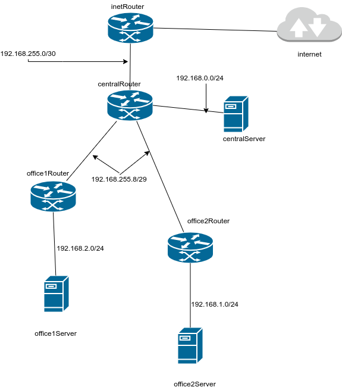
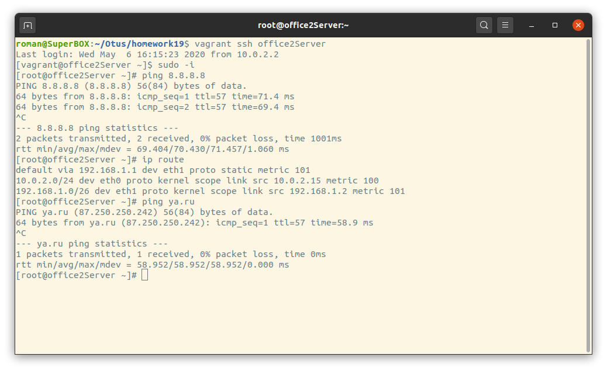
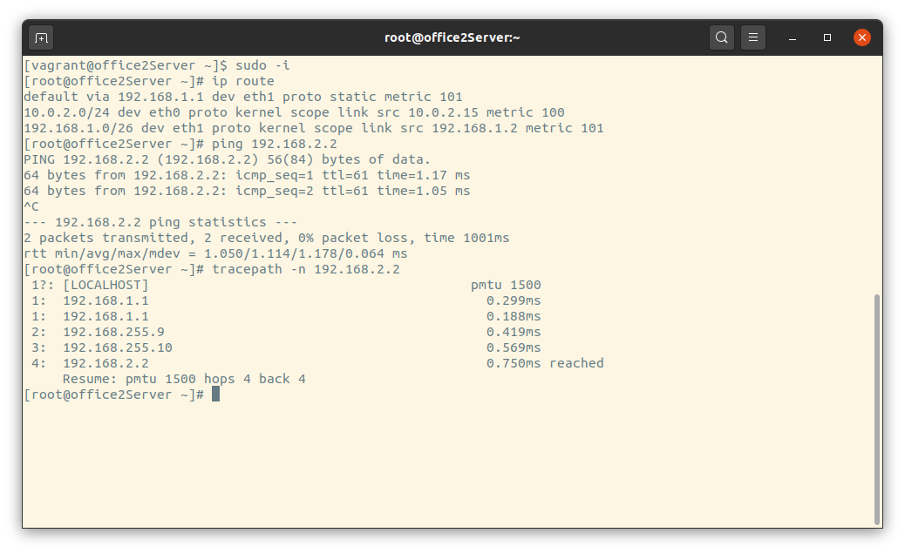

# Домашнее задание 18 
  Network                                      


 - Планируемая архитектура
 - построить следующую архитектуру

 - Разворачиваем сетевую лабораторию
 - Цель: В результате выполнения ДЗ студент развернет сетевую лабораторию.

# otus-linux
Vagrantfile - для стенда урока 9 - Network
тестировалось на virtualbox

# Дано
https://github.com/erlong15/otus-linux/tree/network
(ветка network)

Vagrantfile с начальным построением сети
- inetRouter
- centralRouter
- centralServer192.168.1.192/26  
- 192.168.2.64/26 - test servers
- 192.168.2.128/26 - managers
- 192.168.2.192/26 - office hardware

Сеть office2
- 192.168.1.0/25 - dev
- 192.168.1.128/26 - test servers
- 192.168.1.192/26 - office hardware


Сеть central
- 192.168.0.0/28 - directors
- 192.168.0.32/28 - office hardware
- 192.168.0.64/26 - wifi

```
Office1 ---\
-----> Central --IRouter --> internet
Office2----/
```
Итого должны получится следующие сервера
- inetRouter
- centralRouter
- office1Router
- office2Router
- centralServer
- office1Server
- office2Server

# Теоретическая часть
- Найти свободные подсети
- Посчитать сколько узлов в каждой подсети, включая свободные
- Указать broadcast адрес для каждой подсети
- проверить нет ли ошибок при разбиении

# Практическая часть
- Соединить офисы в сеть согласно схеме и настроить роутинг
- Все сервера и роутеры должны ходить в инет черз inetRouter
- Все сервера должны видеть друг друга
- у всех новых серверов отключить дефолт на нат (eth0), который вагрант поднимает для связи
- при нехватке сетевых интервейсов добавить по несколько адресов на интерфейс


# Результат:

 - Теоретическая часть


Таблица адресного плана.

|Филиал         | Название сети | IP адрес/префикс   | Broadcast    | Диапазона IP-адресов       | Узлов в каждой подсети|
|---------------| ------------- |-------------------:| -------------|----------------------------|-----------------------|
|Office1        | test servers  |192.168.2.64/26     |192.168.2.127 | 192.168.2.66-192.168.2.126 | 62                    |
|Office1        | dev           |192.168.2.0/26      |192.168.2.63  | 192.168.2.1-192.168.2.62   | 62                    |
|Office1        | managers      |192.168.2.128/26    |192.168.2.191 |192.168.2.129-192.168.2.190 | 62                    |
|Office1        |office hardware|192.168.2.192/26    |192.168.2.255 |192.168.2.193-192.168.2.254 | 62                    |
|Central        |directors      |192.168.0.0/28      |192.168.0.15  |192.168.0.1-192.168.0.14    | 14                    |
|Central        |office hardware|192.168.0.32/28     |192.168.0.47  |192.168.0.33-192.168.0.46   | 14                    |
|Central        |wifi           |192.168.0.64/26     |192.168.0.127 |192.168.0.65-192.168.0.126  | 62                    |
|Office2        |router-net     |192.168.255.0/30    |192.168.255.3 |192.168.255.1-192.168.255.2 | 2                     |
|Office2        |central-net    |192.168.255.8/29    |192.168.255.15|192.168.255.9-192.168.255.14| 6                     |
|Office2        | dev           |192.168.1.0/25      |192.168.1.127 |192.168.1.1-192.168.1.126   | 126                   |
|Office2        | test servers  |192.168.1.128/26    |192.168.1.191 |192.168.1.129-192.168.1.190 | 62                    |
|Office2        |office hardware|192.168.1.192/26    |192.168.1.255 |192.168.1.193-192.168.1.254 | 62                    |

* Network Diagram


  
 
# Свободные подсети
  
 Сеть 192.168.0.0/24 
 - 192.168.0.0/28 - directors
 - 192.168.0.48/28
 - 192.168.0.128/25

 Сеть 192.168.1.0/24
 - 192.168.1.128/26
 - 192.168.1.192/26
 - 192.168.1.192/26  
 Сеть 192.168.255.0/24
 - 192.168.255.4/30
 - 192.168.255.16/28
 - 192.168.255.32/27 
 - 192.168.255.64/26 wifi
 - 192.168.255.128/25

 # Практическая часть
  
    Запуск лабораторной работы: 
    vagrant up
    Подключаемся к любой машине проверяем маршрутизацию и доступ.
  


  Для сввязи между офисами добавлены маршруты на centralRouter
 - 192.168.1.0/24 via 192.168.255.11 
 - 192.168.2.0/24 via 192.168.255.10

   
